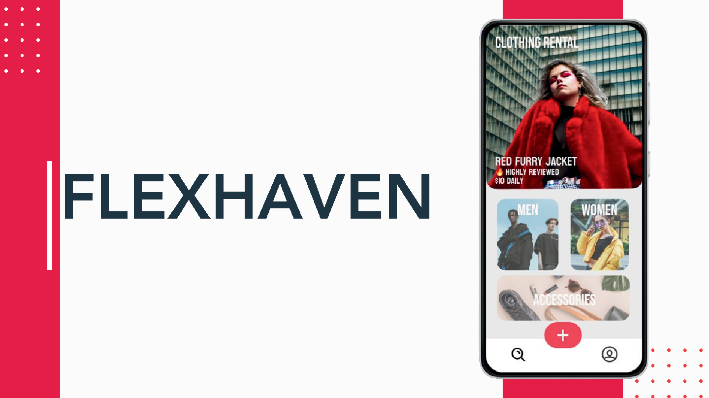

Welcome to the official repository for **Flexhaven**, an Android app created as part of the SUTD 50.002 Introduction to Information Systems, supported by Singtel Singapore. This app serves as a proof of concept for a rental platform specifically designed for students and young working professionals who may find buying new expensive items like suits, iPads, or other equipment unfeasible due to budget constraints. Flexhaven provides a prototype platform for the renting of such items, aiming to offer a sustainable and economical solution.

 **Note**: *This app is still a prototype and does not integrate actual payment systems.*

## Problem Statement

Many students and young professionals are on limited budgets and cannot afford to buy new, expensive clothing or equipment. Our app aims to address this issue by providing a platform for renting these items at a more affordable price.

## Features

- **Browse and Rent**: Users can browse a variety of items and choose to rent them.
- **User Profiles**: Manage your rental transactions through a user-friendly profile.
- **Item Listings**: Users can list items they own for rent.
- **Search**: Search items by categories to find the item to rent

## Technology Stack

- **Java**: Primary programming language for Android development.
- **XML**: Used for designing the user interfaces.
- **Firebase Real-time Database API**: Manages database operations.
- **Firebase Cloud Storage API**: Handles the storage and retrieval of images, with links saved in the real-time database.

## Getting Started

#### Prerequisites

- Download and install Android Studio from [Android Studio Official Site](https://developer.android.com/studio).

#### Installation

1. Clone the repository:
   ```bash
   git clone https://github.com/yourusername/flexhaven.git
   cd flexhaven
2. **Open the project in Android Studio:**
   - Start Android Studio.
   - Click on "Open an existing Android Studio project" and select the project.

3. **Set up an Android emulator or connect an Android device:**
   - To use an emulator, you'll need to create one in Android Studio under AVD Manager (Android Virtual Device).
   - To use a real device, enable developer mode and USB debugging on your Android phone.

4. **Build and run the application:**
   - Click on 'Build' then 'Make Project'.
   - Then click on 'Run' then 'Run 'app'' to launch the application on your emulator or connected device.

## Resources

Here are some additional resources that provide more insight into Flexhaven:

1. **Figma Prototype**: Click [here](https://www.figma.com/proto/Kn4RX2x7WOKHnQSL5ntILf/FLEXHAVEN-Prototype?node-id=65-319&m=dev&scaling=scale-down&page-id=0%3A1&starting-point-node-id=3%3A41&t=oknQu3diKE3XhRjQ-1)
2. **Presentation Slides - Checkoff 1**: Click [here](resources/Flexhaven_Checkoff_1.pdf).
3. **Presentation Slides - Checkoff 2**: Click [here](resources/Flexhaven_Checkoff_2.pdf).
4. **Project Poster**: Check out our informative poster [here](resources/Flexhaven_Final_Poster.pdf).
5. **Introduction Video**: Watch our introductory video [here](resources/Flexhaven_Final_Video.mp4).

## Contact

- Project Link: [https://github.com/yourusername/flexhaven](https://github.com/yourusername/flexhaven)

Thank you for exploring Flexhaven, and we appreciate your interest in supporting affordable and sustainable living solutions!

## Credits
Mok Shum Jung, Ong Jung Yi, Ernest Tan Wei Yan, Tejaswini D/O Venketroyalu, Raymond Khan, Luong Viet Hung
